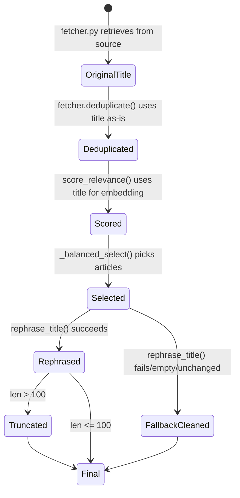

# Design Document: Rephrased Article Titles

## Overview

This feature adds a `rephrase_title()` function to `nlp_pipeline.py` that rewrites each selected article's headline using the existing Groq LLM client (llama-3.1-8b-instant). The rephraser runs in the per-article enrichment loop inside `process_articles()`, after `summarize_article()` completes for each article. On any failure — API exception, empty response, or unchanged output — the system falls back to a cleaned version of the original title (HTML/markdown stripped) without retrying. A hard 100-character limit is enforced via word-boundary truncation. The original publisher title is preserved on the article dict under `original_title` for debugging.

## Architecture

```mermaid
flowchart TD
    A[fetcher.py: fetch + deduplicate] --> B[nlp_pipeline.py: process_articles]
    B --> C[score_relevance]
    C --> D[threshold filter + cascade]
    D --> E[feedback boost]
    E --> F[_balanced_select]
    F --> G[Per-article enrichment loop]
    G --> G1[summarize_article]
    G1 --> G2[rephrase_title]
    G2 --> G3[estimate_reading_time]
    G3 --> H[Return enriched articles]
    H --> I[newsletter_builder.py: build_html]
    I --> J[templates/newsletter.html: render {{ article.title }}]
```

The rephraser fits into the existing pipeline as a new step in the per-article enrichment loop, between summarization and reading-time estimation. No changes to `fetcher.py` or its deduplication logic are needed — dedup operates on the raw `title` field before `process_articles()` is ever called.

## Components and Interfaces

### `rephrase_title(article: dict) -> dict`

**Location:** `nlp_pipeline.py`

**Signature:**
```python
def rephrase_title(article: dict) -> dict:
    """
    Rephrase an article's title using the Groq LLM.
    
    Mutates and returns the article dict with:
      - article['original_title'] = original title (byte-for-byte)
      - article['title'] = rephrased title (or fallback)
    
    On failure: falls back to cleaned original title, no retry.
    """
```

**Behavior:**
1. Store `article['title']` into `article['original_title']`
2. Call `get_groq_client().chat.completions.create(...)` with the rephrasing prompt
3. Validate the response (non-empty, not identical to original after normalization)
4. If valid: apply word-boundary truncation to 100 chars, store in `article['title']`
5. If invalid or exception: apply `_clean_title_fallback()` to original, store in `article['title']`
6. Return the article dict

### `_clean_title_fallback(title: str) -> str`

**Location:** `nlp_pipeline.py`

**Signature:**
```python
def _clean_title_fallback(title: str) -> str:
    """Strip HTML and markdown from a title string. No other modifications."""
```

**Behavior:**
- Strip HTML tags using BeautifulSoup (already a dependency)
- Strip markdown formatting (bold, italic, headers, links, code)
- Return the plain text result (no truncation, no rewording)

### `_truncate_at_word_boundary(text: str, max_len: int = 100) -> str`

**Location:** `nlp_pipeline.py`

**Signature:**
```python
def _truncate_at_word_boundary(text: str, max_len: int = 100) -> str:
    """Truncate text to max_len at the nearest preceding word boundary."""
```

**Behavior:**
- If `len(text) <= max_len`: return text unchanged
- Otherwise: find the last space at or before position `max_len`, truncate there
- If no space found (single very long word): truncate at `max_len` directly
- Strip trailing whitespace from result

### `_is_unchanged_title(original: str, rephrased: str) -> bool`

**Location:** `nlp_pipeline.py`

**Signature:**
```python
def _is_unchanged_title(original: str, rephrased: str) -> bool:
    """Check if rephrased title is effectively identical to original."""
```

**Behavior:**
- Normalize both: lowercase, collapse whitespace, strip
- Return True if normalized forms are equal

### Integration Point: `process_articles()`

The existing per-article enrichment loop changes from:

```python
for i, article in enumerate(top_articles):
    summary = summarize_article(article)
    reading_time = estimate_reading_time(...)
    enriched.append({**article, "summary": summary, "reading_time": reading_time})
```

To:

```python
for i, article in enumerate(top_articles):
    summary = summarize_article(article)
    article_with_summary = {**article, "summary": summary}
    rephrased = rephrase_title(article_with_summary)
    reading_time = estimate_reading_time(...)
    enriched.append({**rephrased, "reading_time": reading_time})
```

### LLM Prompt Design

```python
REPHRASE_TITLE_PROMPT = """Rewrite the following article headline.

Rules:
- Maximum 100 characters
- Crisp, catchy, and engaging for an academically-minded audience
- No clickbait, no sensationalized language, no ALL CAPS, no tabloid style
- No jargon or abbreviations — expand any acronym not universally known
- Preserve the factual meaning: named entities, numbers, and the core claim must remain
- Output ONLY the rewritten headline, nothing else

Original headline: {title}

Rewritten headline:"""
```

**Model parameters:**
- `model`: `"llama-3.1-8b-instant"` (same as summarize_article)
- `max_tokens`: 60 (titles are short)
- `temperature`: 0.7 (allow some creative variation while staying factual)

## Data Models

### Article Record (dict) — After Enrichment

| Field | Type | Source | Description |
|-------|------|--------|-------------|
| `title` | `str` | Rephraser output | The rephrased title (or fallback-cleaned original) |
| `original_title` | `str` | Fetcher | Byte-for-byte original publisher title |
| `url` | `str` | Fetcher | Article URL |
| `source` | `str` | Fetcher | Publisher name |
| `topic` | `str` | Fetcher | Topic category |
| `description` | `str` | Fetcher | Article description/excerpt |
| `content` | `str` | Fetcher | Full article content |
| `published_at` | `str` | Fetcher | Publication timestamp |
| `relevance_score` | `float` | NLP Pipeline | Cosine similarity × recency decay |
| `summary` | `str` | Summarizer | 2-3 sentence TL;DR |
| `reading_time` | `int` | NLP Pipeline | Estimated minutes to read |

### State Transitions for Title Field



## Correctness Properties

*A property is a characteristic or behavior that should hold true across all valid executions of a system — essentially, a formal statement about what the system should do. Properties serve as the bridge between human-readable specifications and machine-verifiable correctness guarantees.*

### Property 1: Title field assignment after rephrasing

*For any* article dict with a non-empty title and *for any* valid (non-empty, different-from-original) LLM response, after `rephrase_title()` completes, `article['title']` SHALL hold the (possibly truncated) rephrased value AND `article['original_title']` SHALL hold the byte-for-byte original title.

**Validates: Requirements 1.2, 1.3, 4.1**

### Property 2: Fallback on invalid LLM response

*For any* article dict with a non-empty title, if the LLM response is empty, whitespace-only, or case-insensitively/whitespace-normalized identical to the original title, then `rephrase_title()` SHALL set `article['title']` to the HTML/markdown-cleaned original title and SHALL NOT retry the LLM call.

**Validates: Requirements 1.5, 1.6, 3.1**

### Property 3: Word-boundary truncation enforces 100-character limit

*For any* string of length > 100 characters, `_truncate_at_word_boundary(text, 100)` SHALL return a string of length ≤ 100 that ends at a word boundary (no partial words), and *for any* string of length ≤ 100, the function SHALL return it unchanged.

**Validates: Requirements 2.5**

### Property 4: HTML and markdown stripping preserves text content

*For any* string containing HTML tags or markdown formatting, `_clean_title_fallback()` SHALL return a string with no HTML tags and no markdown syntax characters, and the plain text content of the original SHALL be a substring of (or equal to) the cleaned output.

**Validates: Requirements 3.2**

### Property 5: Pipeline continuity on rephrasing failure

*For any* list of articles where the Groq client raises an exception for every rephrasing call, `process_articles()` SHALL return the same number of articles as it would without rephrasing, each article SHALL contain both `title` and `original_title` fields, and each SHALL have a `reading_time` value computed.

**Validates: Requirements 3.3, 3.4**

## Error Handling

| Failure Mode | Behavior | Rationale |
|---|---|---|
| Groq API exception (timeout, rate limit, 5xx) | Catch exception, log warning, use `_clean_title_fallback(original)` | Newsletter delivery must not be blocked by a single LLM failure |
| Groq returns empty string | Detect empty/whitespace, use fallback | Treat as a failed rephrase |
| Groq returns title identical to original | Detect via `_is_unchanged_title()`, use fallback | If the LLM couldn't rephrase, don't pretend it did |
| Groq returns title > 100 chars | Truncate at word boundary via `_truncate_at_word_boundary()` | Hard limit protects newsletter layout |
| Article dict missing `title` key | Use empty string as original_title, fallback produces empty string | Defensive — should not occur given fetcher validation |

**No retry policy:** A single failed rephrase for one article should cost 0 additional API calls. The pipeline prioritizes throughput and reliability over title quality for any single article.

**Logging:** Each fallback event is logged at `WARNING` level with the article title and failure reason, matching the existing pattern in `summarize_article()`.

## Testing Strategy

### Property-Based Tests (Hypothesis)

The project already uses Hypothesis (visible in `requirements.txt` and existing test files). Each correctness property above maps to one property-based test with a minimum of 100 iterations.

**Library:** `hypothesis` (already installed)
**Runner:** `pytest` (already installed)
**Test file:** `tldr-newsletter/tests/test_rephrase_title.py`

| Property | Test Function | What Varies |
|---|---|---|
| Property 1 | `test_title_fields_assigned_after_rephrase` | Random article titles, random mocked LLM responses |
| Property 2 | `test_fallback_on_invalid_llm_response` | Random titles, empty/whitespace/identical LLM responses |
| Property 3 | `test_truncation_at_word_boundary` | Random strings of varying lengths (50–300 chars) |
| Property 4 | `test_html_markdown_stripping_preserves_text` | Random strings with injected HTML/markdown |
| Property 5 | `test_pipeline_continuity_on_failure` | Random article lists, Groq always raising exceptions |

**Configuration:**
- Each test: `@settings(max_examples=100, deadline=None)`
- Mock Groq client to avoid real API calls
- Mock sentence-transformers to avoid ML model loading (matching existing test patterns)

### Unit Tests (Example-Based)

| Test | Validates |
|---|---|
| `test_prompt_includes_100_char_instruction` | Req 2.1 |
| `test_prompt_includes_anti_clickbait_instruction` | Req 2.2 |
| `test_prompt_includes_no_jargon_instruction` | Req 2.3 |
| `test_prompt_includes_factual_preservation_instruction` | Req 2.4 |
| `test_rephrase_called_after_summarize` | Req 1.4 |
| `test_dedup_unaffected_by_rephrasing` | Req 4.2 |
| `test_template_renders_title_field` | Req 5.1 |

### Tag Format

Each property test includes a comment:
```python
# Feature: rephrased-article-titles, Property {N}: {title}
```
