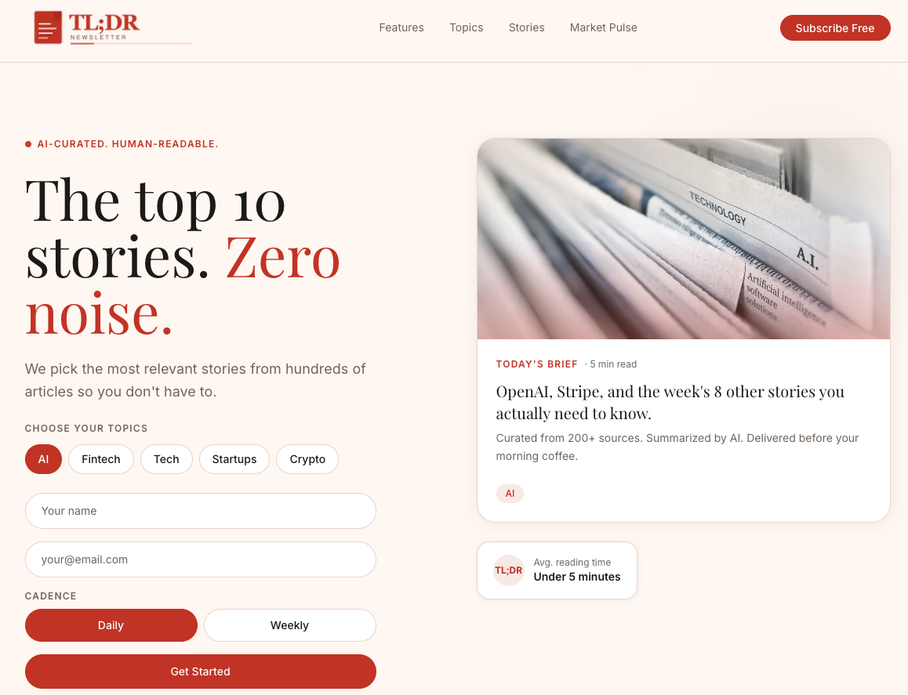

# TL;DR Newsletter: AI-Powered News Digest Platform

> A full-stack NLP system that fetches, ranks, summarizes, and delivers personalized newsletters to subscribers. Built to solve a real problem: staying informed during a 15-minute commute.

## The Problem

As a working student who used to commute 15 minutes by train to work every morning, I wanted a way to stay on top of tech, AI, and fintech news without doomscrolling or reading one 15-minute article about a single topic. Existing newsletters were either too long, too generic, or not personalized to my interests.

## The Solution

TL;DR Newsletter is an end-to-end NLP pipeline that:
1. **Fetches** 150+ articles daily from NewsAPI and curated RSS feeds
2. **Ranks** them using semantic similarity (not keyword matching) against each subscriber's chosen topics
3. **Rephrases** headlines into concise, engaging titles using an LLM
4. **Summarizes** the top 8-10 into 2-3 sentence TL;DRs using an LLM
5. **Delivers** a beautifully formatted, personalized email every morning before 8am

The result: a 5-minute read that covers exactly what matters to you.

---

## Architecture

```
┌─────────────────────────────────────────────────────────────────────┐
│                        DATA INGESTION                               │
│  NewsAPI (keyword queries)  +  RSS Feeds (TechCrunch, Verge, etc.)  │
│  + Manual article injection (manual_articles.json)                  │
│                              ↓                                      │
│                     Deduplication (URL + fuzzy title)               │
└──────────────────────────────┬──────────────────────────────────────┘
                               ↓
┌─────────────────────────────────────────────────────────────────────┐
│                         NLP PIPELINE                                │
│                                                                     │
│  1. Semantic Relevance Scoring                                      │
│     └─ sentence-transformers (all-MiniLM-L6-v2)                     │
│     └─ Cosine similarity: article embedding ↔ topic embedding       │
│     └─ Recency decay: exponential half-life (36h) penalizes stale   │
│     └─ Threshold filter (≥ 0.2) with progressive cascade            │
│        (0.15 → 0.10 → 0.05 → no threshold) if too few articles      │
│                                                                     │
│  2. Balanced Topic Distribution                                     │
│     └─ Slots allocated equally across user's chosen topics          │
│     └─ Prevents one dominant topic from monopolizing the newsletter │
│                                                                     │
│  3. Feedback-Based Personalization                                  │
│     └─ Per-user source boosting from thumbs up/down history         │
│     └─ Score adjustment: ±0.05 per signal, capped at ±0.15          │
│                                                                     │
│  4. LLM Title Rephrasing                                            │
│     └─ Groq API (Llama 3.1 8B Instant)                              │
│     └─ Crisp, engaging headlines ≤100 chars for academic audience   │
│     └─ Truncation detection + fallback to cleaned original          │
│                                                                     │
│  5. LLM Summarization                                               │
│     └─ Groq API (Llama 3.1 8B Instant)                              │
│     └─ Prompt-engineered for concise, factual 2-3 sentence TL;DRs   │
│                                                                     │
│  6. Reading Time Estimation                                         │
│     └─ Full article fetch → word count / 200 WPM                    │
└──────────────────────────────┬──────────────────────────────────────┘
                               ↓
┌─────────────────────────────────────────────────────────────────────┐
│                      EDITORIAL REVIEW                               │
│                                                                     │
│  Two-phase pipeline:                                                │
│    Phase 1 (05:00 UTC): Stage top 15 candidates → admin review      │
│    Phase 2 (05:50 UTC): Send approved picks + AI padding to 8-10    │
│                                                                     │
│  Admin gets an email with approve/reject buttons per article.       │
│  If no editorial input, AI's top 10 go out automatically.           │
└──────────────────────────────┬──────────────────────────────────────┘
                               ↓
┌─────────────────────────────────────────────────────────────────────┐
│                        DELIVERY                                     │
│                                                                     │
│  Jinja2 HTML template → Amazon SES                                  │
│  Personalized per subscriber (name, topics, feedback links)         │
│  Daily (every morning) or Weekly (Mondays) cadence                  │
│  Cross-edition deduplication (never sends the same article twice)   │
└─────────────────────────────────────────────────────────────────────┘
```

---

## Project Structure

```
nlp/
├── tldr-newsletter/          # Python backend — NLP pipeline & email delivery
│   ├── nlp_pipeline.py       # Core NLP: embeddings, scoring, recency decay, summarization, title rephrasing
│   ├── pipeline.py           # Orchestrator: stage → review → send (two-phase)
│   ├── fetcher.py            # Multi-source article fetching (NewsAPI + RSS + manual)
│   ├── newsletter_builder.py # Jinja2 HTML rendering with feedback URLs
│   ├── sender.py             # Amazon SES email delivery
│   ├── scheduler.py          # APScheduler cron jobs (daily/weekly)
│   ├── db.py                 # SQLite: users, feedback, review queue, sent articles
│   ├── app.py                # Streamlit UI: signup, admin panel, live demo
│   ├── send_one.py           # Send newsletter to a single user (manual utility)
│   ├── stats_demo.py         # Demo statistics/analytics
│   ├── manual_articles.json  # Manually curated articles injected into pipeline
│   ├── templates/            # Email HTML template
│   ├── tests/                # Test suite
│   └── deploy_ec2.sh         # EC2 deployment script
│
├── tldr-landing/             # Next.js landing page — subscriber frontend
│   ├── app/                  # App router pages & API routes
│   │   ├── api/subscribe/    # Writes to shared SQLite DB
│   │   └── api/stocks/       # Live SPY market data (Twelve Data API)
│   └── components/           # React components (Hero, Features, Stories, etc.)
│
└── README.md                 # ← You are here
```

---

## Tech Stack

| Layer | Technology | Purpose |
|-------|------------|---------|
| NLP - Embeddings | `sentence-transformers` (all-MiniLM-L6-v2) | Semantic relevance scoring via cosine similarity |
| NLP - Summarization | Groq API (Llama 3.1 8B) | Fast, concise article summaries |
| NLP - Title Rephrasing | Groq API (Llama 3.1 8B) | Engaging headline rewrites |
| Data Ingestion | NewsAPI + RSS (feedparser) + manual JSON | Multi-source article fetching |
| Backend | Python, Streamlit | Pipeline orchestration, admin UI |
| Frontend | Next.js 14, React 18, Tailwind CSS | Landing page, subscriber signup |
| Database | SQLite (shared between frontend & backend) | Users, preferences, feedback, review queue, sent articles |
| Email | Amazon SES + Jinja2 | Personalized HTML newsletter delivery |
| Scheduling | APScheduler | Cron-based daily/weekly pipeline runs |
| Market Data | Twelve Data API | Live S&P 500 stock ticker on landing page |
| Deployment | AWS EC2 + systemd | Production scheduler service |

---

## NLP Techniques Demonstrated

### 1. Semantic Similarity Scoring
Rather than keyword matching, articles are scored by computing cosine similarity between their title+description embedding and the user's topic description embedding. This captures meaning — an article about "Meta's new open-source LLM" correctly matches a "GenAI" topic even without the exact keyword.

### 2. Recency-Weighted Scoring
An exponential decay function (36-hour half-life) multiplies the semantic score, ensuring fresh articles rank higher. A 3-day-old article scores ~25% of an equivalent just-published one.

### 3. Progressive Threshold Cascade
A relevance threshold (0.2) filters out noise. If too few articles pass, the threshold progressively lowers (0.15 → 0.10 → 0.05 → none) to guarantee the newsletter always has enough content to send.

### 4. Balanced Topic Distribution
Instead of sending the global top-N (which can skew heavily toward one hot topic), slots are allocated equally across the user's chosen topics, then remaining slots are filled by highest-scoring overflow.

### 5. LLM-Powered Title Rephrasing
Each article headline is rephrased into a crisp, engaging title (≤100 characters) targeted at an academically-minded audience. Includes truncation detection and graceful fallback to the cleaned original title.

### 6. LLM-Powered Summarization
Each article is summarized into 2-3 factual sentences using a prompt-engineered template. The prompt explicitly avoids filler phrases ("This article discusses...") and focuses on the key insight.

### 7. Feedback Loop / Reinforcement
Subscribers can thumbs-up or thumbs-down individual stories. This feedback adjusts future relevance scores per source — if you consistently like TechCrunch articles, they'll rank slightly higher in your next newsletter.

### 8. Deduplication
URL-based and fuzzy title-based deduplication prevents the same story from appearing twice when it's covered by multiple sources. Cross-edition deduplication ensures a user never sees the same article in consecutive newsletters.

---

## Getting Started

### Prerequisites
- Python 3.11+
- Node.js 18+
- API keys (see below)

### Backend Setup

```bash
cd tldr-newsletter
python -m venv .venv
source .venv/bin/activate
pip install -r requirements.txt
cp .env.example .env   # Fill in your API keys
python -c "from db import init_db; init_db()"  # Initialize database
```

### Frontend Setup

```bash
cd tldr-landing
npm install
# Create .env.local with TWELVE_DATA_API_KEY (optional, for live stock data)
npm run dev
```

### Run the Pipeline

```bash
# Start the Streamlit admin UI
streamlit run app.py

# Stage articles for review (fetch → rank → summarize → save to review queue)
python pipeline.py --stage

# Send newsletters (uses approved articles or AI fallback)
python pipeline.py --send

# Run both phases back-to-back without waiting for review (AI-only selection)
python pipeline.py --force-both

# Start the automated scheduler (runs stage at 05:00 UTC, send at 05:50 UTC)
python scheduler.py
```

---

## Environment Variables

| Variable | Service | Description |
|----------|---------|-------------|
| `NEWS_API_KEY` | [newsapi.org](https://newsapi.org) | Article fetching (free tier: 100 req/day) |
| `GROQ_API_KEY` | [groq.com](https://groq.com) | LLM summarization & title rephrasing (free tier available) |
| `AWS_ACCESS_KEY_ID` | AWS | SES email sending |
| `AWS_SECRET_ACCESS_KEY` | AWS | SES email sending |
| `AWS_REGION` | AWS | SES region (e.g. `us-east-1`) |
| `SES_SENDER_EMAIL` | AWS SES | Verified sender address |
| `ADMIN_EMAIL` | — | Receives review queue notifications |
| `APP_BASE_URL` | — | Base URL for admin action links (default: `http://localhost:8501`) |
| `TWELVE_DATA_API_KEY` | [twelvedata.com](https://twelvedata.com) | Live stock prices (landing page) |

---

## Deployment

The scheduler runs as a systemd service on AWS EC2 with:
- IAM role configuration (no stored credentials on instance)
- User-data bootstrap script
- systemd service unit
- Auto-update via cron

---

## Sample Edition

Here's what a subscriber receives every morning:


📩 [Download the raw email file](sample_edition.eml) to view an actual full edition in your mail client.

---

## Landing Page



🔴 Live at codesonline.rocks — feel free to subscribe! You'll receive a verification email, and you can unsubscribe anytime.

---

## What I Learned

- Sentence embeddings are surprisingly effective for content relevance scoring — much better than TF-IDF or keyword matching for this use case
- Prompt engineering matters: small changes to the summarization prompt dramatically affect output quality
- A two-phase pipeline (stage → review → send) gives editorial control without blocking automation. I caught a few glitched links during review that came from NewsAPI — and blocked that source going forward.
- Feedback loops create a virtuous cycle — even simple thumbs up/down signals meaningfully improve personalization over time
- Guaranteed minimum delivery (progressive threshold cascade + freshness widening) is essential — an empty newsletter is worse than a slightly less relevant one. Early on, strict relevance grading caused one edition to deliver only 2 articles; thanks to a subscriber's feedback that prompted the cascade fix.
- Balanced topic distribution prevents a single trending topic from dominating the entire newsletter
- Sharing a SQLite database between a Python backend and Next.js frontend is pragmatic for a solo project but wouldn't scale to production

---

## Future Improvements

- [ ] Named Entity Recognition (NER) for auto-tagging people, companies, and products
- [ ] Sentiment analysis to flag controversial or negative stories
- [ ] Clustering to group related stories and avoid redundancy
- [ ] PostgreSQL for multi-user production deployment
- [ ] A/B testing different summarization prompts
- [ ] Click-through tracking for better relevance feedback

---

## License

This project was built as a university coursework project. Feel free to explore the code.
